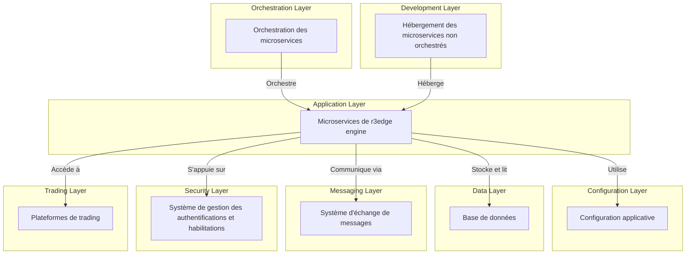
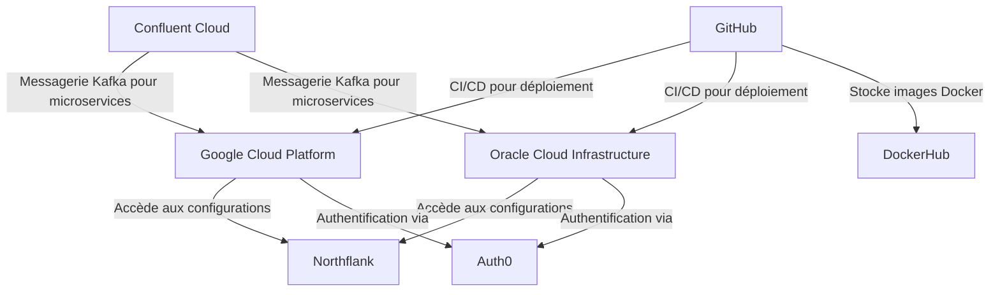
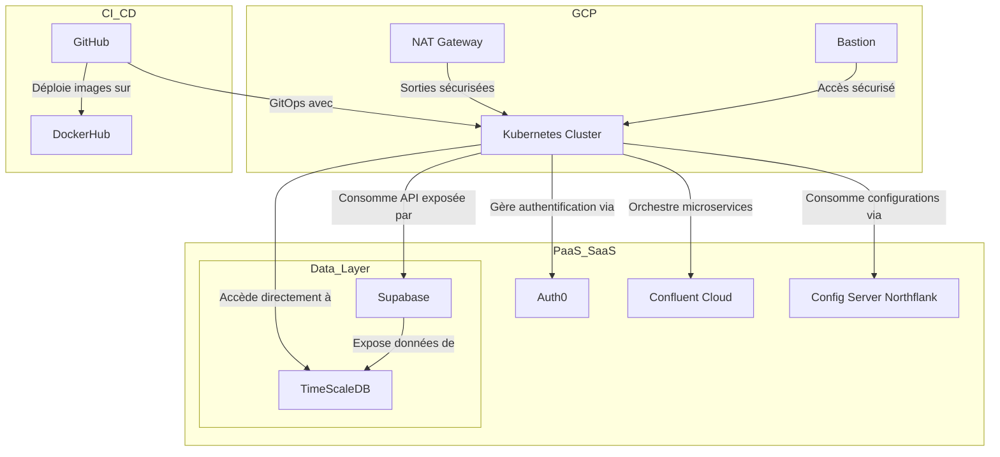
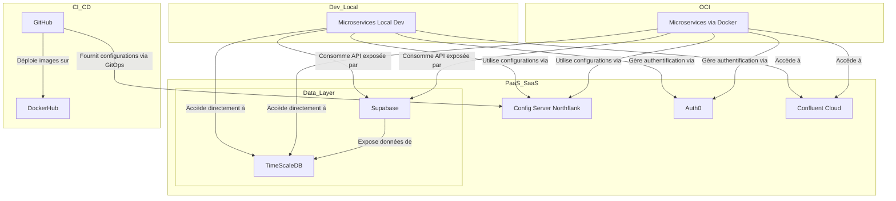

# Architecture de Solution

Ce document décrit l'architecture de solution, c'est à dire les constituantes de la plateforme de production et les constituants de la plateforme de développement. Il explique également les raisons des différents choix effectués.
Les principes de base:
- limiter les couts en utilisant au maximum les offres free et always free disponibles sur le marché
- architecture de microservices sur le cloud
- pratiques devops favorisés et automatisation maximum
- kubernetes comme orchestrateur mais uniquement pour la production. Pour optimiser les coûts, l'environnement de développement peux s'éxécuter en dehors d'un orchestrateur

---

## Table des matières
- [Liste des sous-systèmes](#liste-des-sous-systèmes)
- [Environnement de Production](#environnement-de-production)
- [Environnement de Développement](#environnement-de-développement)
- [À traiter plus tard](#à-traiter-plus-tard)

## Liste des sous-systèmes

- microservices de r3edge engine
- configuration applicative
- base de données
- système d'échange messages entre microservices
- système de gestion des authentifications et habilitations
- plateformes de trading
- orchestration des microservices (pour la production)
- hébergement des microservices non orchestrés (pour le développement)

Liste des plateformes physiques:
- Northflank
- Google cloud platform
- Oracle Cloud Infrastructure
- Confluent cloud
- Github
- dockerHub
- Auth0

## Environnement de Production

L’environnement de production est conçu pour garantir haute disponibilité, scalabilité, et sécurité des services déployés. Il repose sur une infrastructure orchestrée par Kubernetes, complétée par des solutions PaaS/SaaS pour simplifier la gestion des configurations, des données et des communications entre microservices.

## Environnement de Développement

Permettre le développement local des microservices sans dépendance directe à Kubernetes.Réduire la complexité technique tout en garantissant un comportement proche de l’environnement de production.

## À traiter plus tard

### Écarts identifiés sans Kubernetes

#### Résolution DNS interne
En absence de DNS interne Kubernetes, les services ne peuvent pas se résoudre automatiquement via des noms comme `service2.default.svc.cluster.local`. En local, cette fonctionnalité est remplacée par un mécanisme basé sur des configurations centralisées dans Spring Config Server.

#### Annuaire de services (Service Discovery)
Kubernetes gère nativement la découverte des services via ses objets `Service`. Sans Kubernetes, une solution externe ou une configuration manuelle est nécessaire. Toutefois, pour un environnement de développement avec un nombre limité de services, un annuaire est considéré comme superflu.

#### Dépendances inter-services
Kubernetes orchestre les dépendances et vérifie que les services sont disponibles avant de rediriger le trafic. En local, cela doit être géré manuellement via des vérifications de disponibilité (`/actuator/health`) ou des mécanismes comme Spring Retry.

#### API Gateway (Traefik)
En production, Traefik agit comme un point d’entrée central pour les clients externes, gérant :
- Le routage des requêtes vers les microservices.
- La gestion des certificats SSL.
- La centralisation des règles de sécurité et des authentifications.

Dans l’environnement de développement, cette API Gateway n’est pas utilisée pour les communications internes entre microservices, mais elle reste dédiée aux appels des clients externes si nécessaire.

#### Scalabilité et Load Balancing (non traité ici)
Kubernetes offre un équilibrage de charge automatique et le scaling dynamique. En local, cela nécessite des outils ou scripts supplémentaires, mais ces besoins sont écartés pour l’environnement de développement.

#### Gestion des secrets et configurations
Kubernetes gère les secrets et configurations via ConfigMaps et Secrets. En local, ces éléments sont externalisés et gérés par Spring Config Server pour assurer une centralisation des paramètres sensibles.

#### Monitoring et observabilité (non traité ici)
En local, les logs et métriques ne sont pas centralisés. L’observabilité complète est reportée à des outils intégrés en production (ex. Prometheus, Grafana).

#### Exposition et routage des services (non traité ici)
En production, Kubernetes utilise des `Ingress` pour gérer les routes HTTP(S). En local, ces fonctionnalités sont simplifiées avec des URLs locales ou via des mécanismes comme Docker Compose.

### Focus sur les 4 sujets majeurs

#### Résolution DNS interne
Mise en place d’un mécanisme basé sur Spring Config Server pour reconstituer dynamiquement les URLs des services en fonction de l’environnement (dev, test, prod).  
- Les préfixes (`localhost`) et les suffixes DNS (`svc.cluster.local`) sont externalisés dans des fichiers YAML gérés par Config Server.  
- Les microservices se limitent à utiliser uniquement le nom du service cible (ex. `service2`).

#### Annuaire de services
La découverte des services est simplifiée via Config Server.  
- Pour un nombre limité de services en environnement de développement, un annuaire dynamique (ex. Eureka) est jugé non nécessaire.  
- Les dépendances sont déclarées statiquement dans Config Server ou les fichiers de configuration.

#### Dépendances inter-services
Implémentation d’un mécanisme basé sur Spring Retry et Feign pour gérer les dépendances critiques.  
- Vérification de la disponibilité des services via `/actuator/health`.  
- Les dépendances sont testées avant l’initialisation complète des microservices.

#### Appels inter-services
Les appels entre microservices sont gérés directement via des clients HTTP comme **Spring OpenFeign** ou **Spring WebClient** :  
- **OpenFeign** : Offre une syntaxe déclarative pour simplifier les appels entre services.
- **WebClient** : Option réactive adaptée pour des besoins asynchrones ou hautement concurrents.  
L’API Gateway (Traefik) n’est pas utilisée pour les communications internes, car elle est exclusivement réservée aux appels externes.

---

<!-- Pied de page -->
## Liens utiles
- [Retour à la Table des Matières](index.md)
- [Dépôt principal de la documentation](https://github.com/dsissoko/r3edge-engine-docs)
