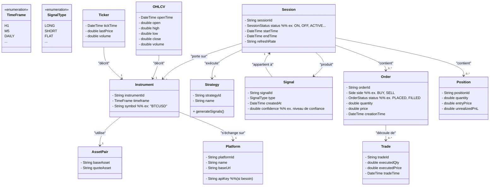

<!-- Haut de page -->
---
title: Modèles de Données et Processus Métiers
description: Document présentant les modèles de données et les processus métiers du projet.
last_updated: 2025-01-03
---

# Modèles de Données et Processus Métiers

Ce document présente les modèles de données utilisés dans le projet ainsi que les processus métiers associés.

---

## Table des matières
- [Modèles de Données](#modeles-de-donnees)
  - [Structure des Données](#structure-des-donnees)
  - [Règles de Stockage](#regles-de-stockage)
- [Processus Métiers](#processus-metiers)
  - [Séquence de Trading Détaillée](#sequence-de-trading-detaillee)

## Modèles de Données

### Structure des Données
Les données principales gérées par le projet incluent :
- **Données utilisateurs** : Profils, abonnements, et activités.
- **Données de marché** : Données OHLCV, niveaux de volume, et profondeur de marché.
- **Données analytiques** : Indicateurs calculés et rapports générés.

Chaque type de données est structuré en utilisant des modèles relationnels dans **PostgreSQL** ou des structures optimisées pour le cache via **Hazelcast**.

### Règles de Stockage
- **Persistance** : Les données critiques sont sauvegardées dans PostgreSQL avec une politique de haute disponibilité.
- **Cache distribué** : Utilisation de Hazelcast pour les données à haute fréquence d’accès (ex. sessions utilisateur).
- **Archivage** : Les données historiques sont archivées après 12 mois dans un stockage froid.

## Processus Métiers

### Séquence de Trading Détaillée

#### Introduction
La séquence de trading détaillée décrit les étapes complètes impliquées dans l’exécution d’une opération de trading au sein de r3edge-engine. Ce processus est conçu pour assurer une exécution rapide, précise et conforme aux stratégies définies par les utilisateurs.

#### Étapes du Processus
1. **Analyse des Données de Marché**
   - Collecte des données en temps réel.
   - Analyse des tendances et des indicateurs techniques.
2. **Définition des Stratégies de Trading**
   - Sélection des stratégies basées sur les analyses.
   - Configuration des paramètres spécifiques à chaque stratégie.
3. **Génération des Ordres de Trading**
   - Création automatique des ordres en fonction des stratégies définies.
   - Validation des ordres avant l’exécution.
4. **Exécution des Ordres**
   - Envoi des ordres aux plateformes de trading.
   - Suivi en temps réel de l’exécution des ordres.
5. **Surveillance et Reporting**
   - Surveillance continue des performances des ordres exécutés.
   - Génération de rapports détaillés sur les transactions réalisées.

#### Conclusion
La séquence de trading détaillée est au cœur du fonctionnement de r3edge-engine, garantissant que chaque opération de trading est exécutée de manière optimale et efficace. Ce processus intégré permet aux utilisateurs de se concentrer sur la définition de leurs stratégies tout en laissant le moteur gérer l’exécution et le suivi des ordres.

---

<!-- Pied de page -->
## Liens utiles
- [Retour à la Table des Matières](index.md)
- [Dépôt principal de la documentation](https://github.com/dsissoko/r3edge-engine-docs)
