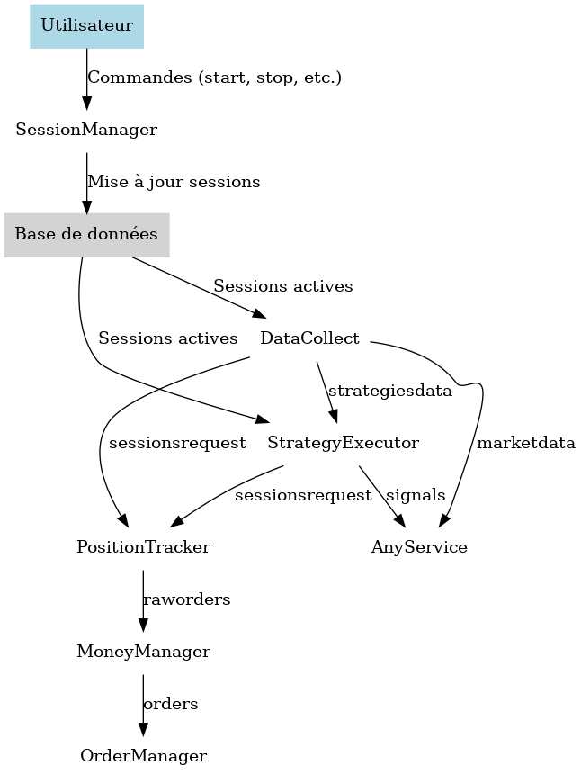

# Services Backend

L'architecture de r3edge repose sur plusieurs microservices bien définis, chacun ayant un rôle spécifique pour répondre aux besoins du projet.

---

## Table des matières
- [Quelques définitions](#quelques-définitions)
- [Exposition des services](#exposition-des-services)
- [Communication interservices](#communication-interservices)
- [Liste des services](#liste-des-services)
- [Stratégies de Scaling Horizontal](#stratégies-de-scaling-horizontal)
- [Partitionnement des Topics Kafka](#partitionnement-des-topics-kafka)
- [Filtrage et Émission des Topics](#filtrage-et-emission-des-topics)

---

## Quelques définitions

Un service central est unique dans le système et non multipliable fonctionnellement, tandis qu'un service factorisable peut être répliqué par besoin fonctionnel, comme par plateforme ou stratégie.

---

## Exposition des services

Traefik, en tant qu'API Gateway, joue un rôle clé en exposant à l'externe une API unifiée pour l'ensemble des microservices de r3edge-engine. Cette API permet aux clients externes d'interagir de manière centralisée avec les différents services backend, sans avoir besoin de connaître leur architecture interne.

---

## Communication interservices

Dans l'architecture de r3edge, les communications entre les microservices backend sont gérées directement, sans passer par l'API Gateway (Traefik). Les services échangent principalement via des API REST internes, des topics Kafka, ou d'autres mécanismes asynchrones.

### Topics Kafka

Les topics Kafka sont le principal mécanisme d'échange asynchrone entre les microservices. Chaque topic est partitionné et consommé via des consumer groups, garantissant l'isolation et la scalabilité des services.

Liste des principaux topics et leur partitionnement :

| **Topic**          | **Clé de Partition**  | **Données Transportées**         | **Consommateurs**       |
|---------------------|-----------------------|------------------------------------|--------------------------|
| `marketdata`        | Aucun (broadcast)     | OHLCV brut                        | AnyService               |
| `strategiesdata`    | `strategyId`         | OHLCV filtré pour les stratégies  | StrategyExecutor         |
| `sessionsrequest`   | `sessionId`          | Demandes de suivi de position     | PositionTracker          |
| `signals`           | Aucun (broadcast)    | Signaux non filtrés               | AnyService               |
| `raworders`         | `orderId`            | Ordres bruts sans quantité        | MoneyManager             |
| `orders`            | `orderId`            | Ordres complets prêts à exécuter  | OrderManager             |

### Diagramme des interactions

Le schéma ci-dessous illustre les interactions principales entre les services backend, les utilisateurs et les topics Kafka :

---

## Liste des services

### TemplateService
- **Rôle** : Service template à personnaliser pour les futurs microservices.
- **Détail** : [Voir la page dédiée](TemplateService.md)

### DataCollect
- **Rôle** : Collecte les données de marché en temps réel depuis les plateformes.
- **Filtrage des données** :
  - DataCollect applique des filtres dynamiques en fonction des stratégies et des sessions actives, garantissant que seuls les messages pertinents sont envoyés sur les topics Kafka.
  - Exemple de filtres :
    - **Timeframes** (à partir des stratégies actives)
    - **Marchés** (ex : BTC/USD, CAC40)
    - **Plateformes** (ex : kraken, binance)
  - **Topic bénéficiant du filtrage** : `strategiesdata`.
- **Détail** : [Voir la page dédiée](DataCollect.md)

### StrategyExecutor
- **Rôle** : Consomme les topics de session pour exécuter les stratégies définies.
- **Organisation des consumer groups** :
  - Les instances de StrategyExecutor rejoignent des consumer groups correspondant aux stratégies qu'elles gèrent.
  - Une instance peut appartenir à plusieurs consumer groups si elle gère plusieurs stratégies (ex : `strategy1-group`, `strategy3-group`).
- **Filtrage des signaux** :
  - StrategyExecutor filtre les signaux générés pour ne publier que ceux pertinents aux sessions actives.
  - **Topic bénéficiant du filtrage** : `sessionsrequest`.
- **Détail** : [Voir la page dédiée](StrategyExecutor.md)

### SessionManager
- **Rôle** : Gère les sessions de trading : création, démarrage, pause, suppression.
- **Type** : REST Controller.
- **Responsabilités principales** :
  - Reçoit et traite les demandes des utilisateurs via une API REST pour gérer les sessions.
  - Met à jour les informations des sessions (état, configuration, etc.) dans la base de données.
  - Assure la persistance des états des sessions actives pour permettre leur utilisation par d'autres services, comme DataCollect et StrategyExecutor.
- **Détail** : [Voir la page dédiée](SessionManager.md)

### PositionTracker
- **Rôle** : Suit les ordres placés et les positions associées de manière stateless.
- **Consommation du topic `sessionsrequest`** :
  - PositionTracker consomme les messages de suivi de session filtrés par DataCollect et StrategyExecutor.
  - Scalabilité assurée via un consumer group avec partitionnement par `sessionId`.
- **Détail** : [Voir la page dédiée](PositionTracker.md)

### MoneyManager
- **Rôle** : Ajuste les quantités d'ordres sur la base des données de risque et de portefeuille.
- **Interaction avec Kafka** :
  - Consomme le topic `raworders` pour enrichir les ordres.
  - Publie les ordres complétés sur le topic `orders`.
- **Détail** : [Voir la page dédiée](MoneyManager.md)

---

## Stratégies de Scaling Horizontal

### Scaling des services via Kafka
- Les services utilisent des consumer groups pour scaler horizontalement sans conflit.
- Chaque topic est partitionné en fonction des clés pertinentes (à définir par service).

Exemple :
- **DataCollect** : Partitionnement par `market+symbol+timeframe`.
- **StrategyExecutor** : Partitionnement par `strategyId`.
- **SessionManager** : Load Balancing pour traiter les requêtes REST simultanées.
- **PositionTracker** : Partitionnement par `sessionId`.
- **MoneyManager** et **OrderManager** : Partitionnement par `orderId`.

---

## Partitionnement des Topics Kafka

Le tableau suivant synthétise le partitionnement appliqué aux principaux topics :

| **Topic**          | **Clé de Partition**  | **Description**                                                |
|---------------------|-----------------------|----------------------------------------------------------------|
| `marketdata`        | Aucun (broadcast)     | Diffusion globale des données OHLCV brutes.                   |
| `strategiesdata`    | `strategyId`         | Données filtrées pour les stratégies actives.                 |
| `sessionsrequest`   | `sessionId`          | Demandes de suivi de position pour les sessions actives.       |
| `signals`           | Aucun (broadcast)    | Signaux non filtrés pour les consommateurs génériques.         |
| `raworders`         | `orderId`            | Ordres bruts sans quantité.                                   |
| `orders`            | `orderId`            | Ordres enrichis prêts à être exécutés.                        |

---

## Filtrage et Émission des Topics

### Filtrage dynamique
Les services émetteurs (DataCollect, StrategyExecutor) appliquent des filtres pour réduire le bruit et garantir la pertinence des messages publiés. 

| **Service**          | **Topic**          | **Critères de Filtrage**                                     |
|-----------------------|--------------------|--------------------------------------------------------------|
| **DataCollect**       | `strategiesdata`  | Stratégies actives : timeframe, marché, plateforme.          |
| **DataCollect**       | `sessionsrequest` | Sessions actives associées aux données collectées.          |
| **StrategyExecutor**  | `sessionsrequest` | Signaux pertinents pour les sessions actives.               |

---

## Liens utiles
- [Retour à la Table des Matières](index.md)
- [Dépôt principal de la documentation](https://github.com/dsissoko/r3edge-engine-docs)
