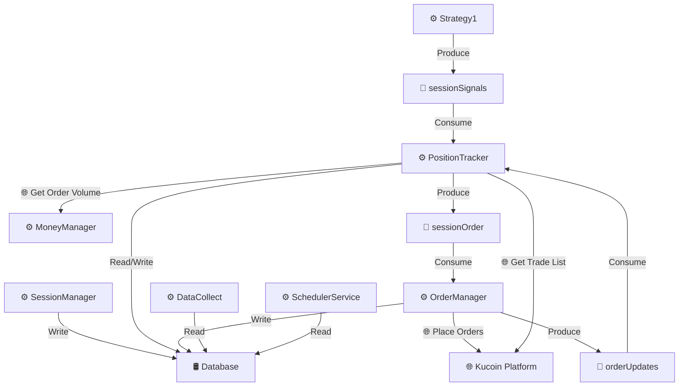
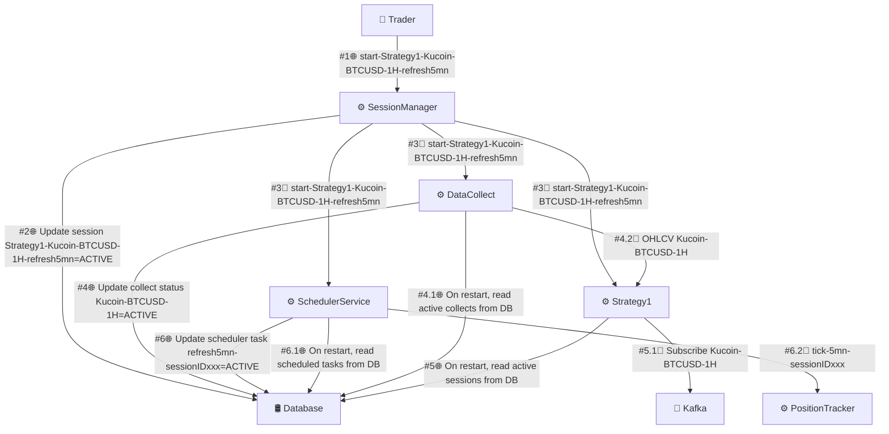
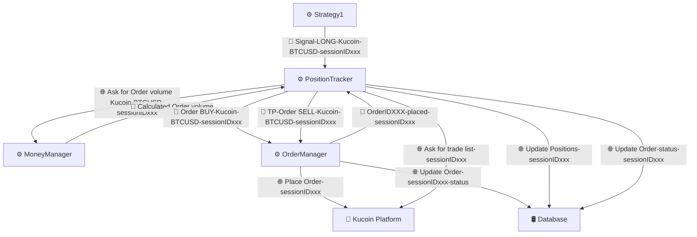
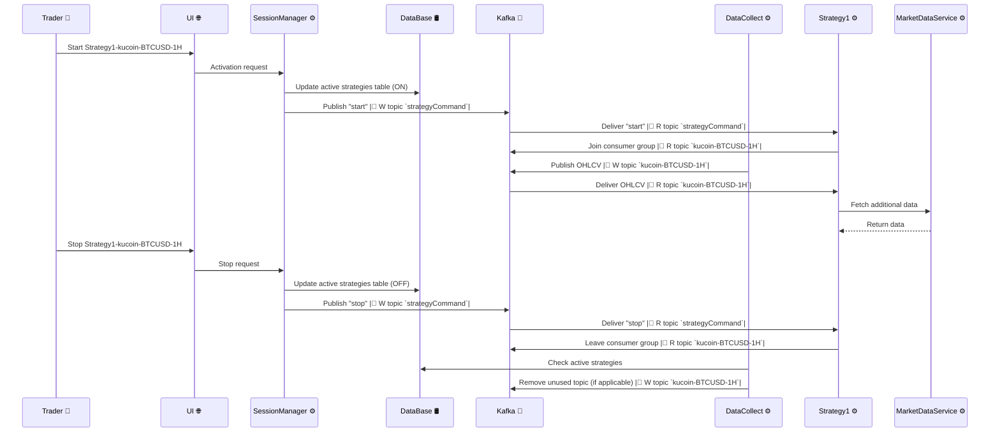
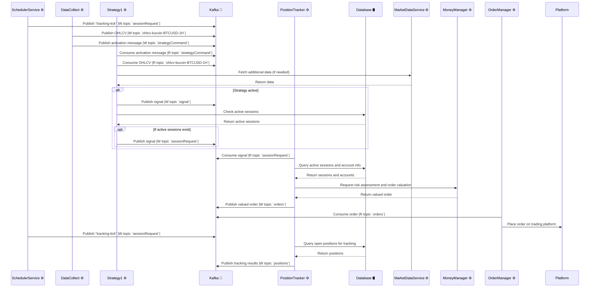

# Services Backend

L'architecture de r3edge repose sur plusieurs microservices bien définis, chacun ayant un rôle spécifique pour répondre aux besoins du projet.

---

## Table des matières
- [Quelques définitions](#quelques-définitions)
- [Exposition des services](#exposition-des-services)
- [Communication interservices](#communication-interservices)
- [Liste des services](#liste-des-services)
- [Stratégies de Scaling Horizontal](#stratégies-de-scaling-horizontal)
- [Partitionnement des Topics Kafka](#partitionnement-des-topics-kafka)
- [Filtrage et Émission des Topics](#filtrage-et-emission-des-topics)

---

## Quelques définitions

Un service central est unique dans le système et non multipliable fonctionnellement, tandis qu'un service factorisable peut être répliqué par besoin fonctionnel, comme par plateforme ou stratégie.

---

## Exposition des services

Traefik, en tant qu'API Gateway, joue un rôle clé en exposant à l'externe une API unifiée pour l'ensemble des microservices de r3edge-engine. Cette API permet aux clients externes d'interagir de manière centralisée avec les différents services backend, sans avoir besoin de connaître leur architecture interne.

---

## Communication interservices

Dans l'architecture de r3edge, les communications entre les microservices backend sont gérées directement, sans passer par l'API Gateway (Traefik). Les services échangent principalement via des API REST internes, des topics Kafka, ou d'autres mécanismes asynchrones.

### Topics Kafka

Les topics Kafka sont le principal mécanisme d'échange asynchrone entre les microservices. Chaque topic est partitionné et consommé via des consumer groups, garantissant l'isolation et la scalabilité des services.

### Diagramme des interactions

Le schéma ci-dessous illustre les interactions principales entre les services backend, les utilisateurs et les topics Kafka :

### Légende

| **Symbole** | **Description**                                    |
|-------------|----------------------------------------------------|
| ⚙️          | Service applicatif (ex. : SessionManager, Strategy1)|
| 🛢️          | Base de données pour stockage des informations     |
| 🔀          | Topic Kafka utilisé pour la communication inter-services |
| 🌐          | Requête API ou interaction avec une plateforme externe |

---
### Exemple d'une session de trading
Cet exemple illustre les interactions entre les services durant une session de trading r3edge engine avec 3 scénarios:
- start d'une session à partir d'un trader utilisateur pour  strategy1 sur kucoin pour BTCUSC en time frame 1H et avec une cadence de suivi de 5 mn
- coeur de session avec déclenchement d'un signal par Strategy1. Ce signal va générer in fine un passage d'ordre, un suivi de positions jusqu'à un TP ou un SL ou un MO (Market Order)
- stop de la session de trading

#### Scénario : Démarrage d'une session de trading

##### **But du scénario : Démarrer une session de trading**
- Déclarer la session ACTIVE en base de données.
- Programmer un scheduler pour cadencer **PositionTracker** toutes les 5 minutes.
- Créer un topic dynamique dédié à **Kucoin-BTCUSD-1H**, alimenté par **DataCollect** et consommé par **Strategy1**.
- Activer **Strategy1** pour **Kucoin-BTCUSD-1H**.
- Identifier clairement les topics et leur mode de consommation.
- Décrire la résilience et la scalabilité de chaque service.

---

##### **Point de départ**
- **r3edge engine** est démarré.
- **Strategy1** est chargée mais dormante, et a souscrit à un consumergroup du topic `command` dédié aux stratégies.
- **DataCollect** a démarré sa collecte des données définies dans sa configuration initiale, y compris **Kucoin-BTCUSD-1H**, et a également souscrit à un consumergroup du topic `command` dédié à la collecte.
- **SchedulerService** est chargé mais dormante, et a souscrit à un consumergroup du topic `command` dédié au scheduler.

---

##### **Liste des interactions**
1. **Trader** envoie `start-Strategy1-Kucoin-BTCUSD-1H-refresh5mn` à **SessionManager**.
2. **SessionManager** écrit `Strategy1-Kucoin-BTCUSD-1H-refresh5mn-sessionIDxxx=ON` dans la base de données.
3. **SessionManager** envoie `start-Strategy1-Kucoin-BTCUSD-1H-refresh5mn-sessionIDxxx` sur le topic `command` à :
   - **Strategy1**
   - **SchedulerService**
   - **DataCollect**
4. **Strategy1** s'abonne au topic dynamique **Kucoin-BTCUSD-1H** via son consumergroup dédié.
5. **SchedulerService** reçoit `start-Strategy1-Kucoin-BTCUSD-1H-refresh5mn-sessionIDxxx`, programme le scheduler, et envoie toutes les 5 minutes un tick `tick-5mn-sessionIDxxx` sur le topic `sessionRequest` à **PositionTracker**.
6. **DataCollect** envoie les **OHLCV 1H** sur le topic **Kucoin-BTCUSD-1H**, consommé par **Strategy1**.

---

##### **Point d'arrivée**
- **Strategy1** est activée.
- **SchedulerService** est auto-programmé pour envoyer des ticks toutes les 5 minutes pour **sessionIDxxx**.
- **DataCollect** alimente en **OHLCV** un topic dynamique consommé par **Strategy1**.
- **PositionTracker** est cadencé toutes les 5 minutes pour actualiser les positions (valorisation).

##### Graphe des interactions

##### Tableau des topics

| **Topic**          | **Exemple / Partition**                                                | **Producteur**       | **Consommateurs**                                         |
|---------------------|-----------------------------------------------------------------------|----------------------|-----------------------------------------------------------|
| `command`          | `start-Strategy1-Kucoin-BTCUSD-1H-refresh5mn`   *Clé = sessionIDxxx → Partition 1* | SessionManager       | - Strategy1 (`group.command.strategy`)                     - SchedulerService (`group.command.scheduler`)             - DataCollect (`group.command.collect`)             |
| `Kucoin-BTCUSD-1H` | `OHLCV Kucoin-BTCUSD-1H`   *Clé = Kucoin-BTCUSD-1H → Partition 1*   | DataCollect          | - Strategy1 (`group.kucoin.strategy`)                    |
| `sessionRequest`   | `tick-5mn-sessionIDxxx`   *Clé = sessionIDxxx → Partition 1*        | SchedulerService     | - PositionTracker (`group.session.tracker`)              |

#### Scénario : Déclenchement d'un signal par Strategy1

##### **But du scénario : Générer des signaux**
- Envoyer des signaux LONG/SHORT lorsque **Strategy1** détecte des opportunités.
- Placer des ordres sur Kucoin tout en maîtrisant les risques (via **MoneyManager**).
- Identifier les ordres exécutés et suivre les positions prises.
- Gérer les ordres de type TP (Take Profit), SL (Stop Loss), et MO (Market Order), déclenchés par **PositionTracker**.

---

##### **Point de départ**
- **Strategy1** est activée et souscrit au topic `sessionSignals` pour générer des signaux.
- **SchedulerService** est programmé pour envoyer des ticks toutes les 5 minutes pour la sessionIDxxx.
- **DataCollect** alimente en OHLCV le topic dynamique `Kucoin-BTCUSD-1H`, consommé par **Strategy1**.
- **PositionTracker** est cadencé toutes les 5 minutes pour actualiser les positions (valorisation) et gérer les exécutions d'ordres.

---

##### **Liste des interactions**
1. **Strategy1** envoie `Signal-LONG-Kucoin-BTCUSD-sessionIDxxx` sur le topic `sessionSignals` à **PositionTracker**.
2. **PositionTracker** demande le volume d'ordre à **MoneyManager** via `Ask for Order volume Kucoin-BTCUSD-sessionIDxxx`.
3. **MoneyManager** renvoie le volume calculé à **PositionTracker**.
4. **PositionTracker** envoie `Order BUY-Kucoin-BTCUSD-sessionIDxxx` sur le topic `sessionOrder` à **OrderManager**.
5. **OrderManager** place l’ordre sur la plateforme Kucoin et met à jour la base avec `Order-sessionIDxxx-status`.
6. **OrderManager** envoie une mise à jour d'ordre via `OrderIDXXX-placed-sessionIDxxx` sur le topic `orderUpdates` à **PositionTracker**.
7. **PositionTracker** demande la liste des trades associés (`trade list-sessionIDxxx`) à Kucoin.
8. **PositionTracker** met à jour la base avec :
   - Les positions associées à la session (`Positions-sessionIDxxx`).
   - Le statut des ordres (`Order-status-sessionIDxxx`).
9. Si un TP/SL est déclenché, **PositionTracker** envoie `TP-Order SELL-Kucoin-BTCUSD-sessionIDxxx` sur le topic `sessionOrder` à **OrderManager**.

---

##### **Point d'arrivée**
- La base de données est mise à jour avec :
  - Les ordres passés sur Kucoin (OPENED, CLOSED, CANCELED).
  - Les trades réalisés suite à l'exécution des ordres.
  - Le statut et le niveau d'exécution des ordres (NOT_EXECUTED, PARTIALLY_EXECUTED, FULLY_EXECUTED).

##### Tableau des topics

| **Topic**          | **Exemple / Partition**                                        | **Producteur**         | **Consommateurs**                                         |
|---------------------|--------------------------------------------------------------|------------------------|-----------------------------------------------------------|
| `sessionSignals`    | `Signal-LONG-Kucoin-BTCUSD-sessionIDxxx`                     | Strategy1              | PositionTracker                                           |
| `sessionOrder`      | `Order BUY-Kucoin-BTCUSD-sessionIDxxx`                       | PositionTracker        | OrderManager                                              |
| `orderUpdates`      | `OrderIDXXX-placed-sessionIDxxx`                             | OrderManager           | PositionTracker                                           |
| `tradeUpdates`      | `Trade Kucoin-BTCUSD-sessionIDxxx`                           | PositionTracker        | Aucun                                                    |

## Liste des services

### DataCollect
- **Rôle** : Collecte des données de marché en temps réel depuis des APIs externes.
- **Interactions** :
  - **Entrées** : APIs des plateformes de trading.
  - **Sorties** :
    - `marketdata` : Données OHLCV brutes.
    - `strategiesdata` : Données filtrées pour les stratégies actives.
    - `sessionsrequest` : Demandes de suivi de position.
- **Comment le service peut scaler ?** :
  - Scaling horizontal avec Kubernetes : chaque instance collecte un sous-ensemble défini de marchés, actifs et timeframes.
  - Réattribution automatique des tâches via une table centralisée qui distribue dynamiquement les workloads.
  - **Émetteur lié** : DataCollect filtre les OHLCV pour `strategiesdata` à partir des informations de filtre publiées par les instances actives de StrategyExecutor.
- **Détail** : [Voir la page dédiée](DataCollect.md)

---

### SessionManager
- **Rôle** : Gestion des sessions de trading (création, démarrage, mise en pause, suppression).
- **Interactions** :
  - **Entrées** : Commandes utilisateur (start, stop, pause).
  - **Sorties** : Mise à jour des sessions dans la base de données.
- **Comment le service peut scaler ?** :
  - Load balancing entre instances via Kubernetes et un service REST exposé.
  - **Émetteur lié** : Les modifications des sessions sont propagées via la base de données, et les services consommateurs interrogent ces informations en temps réel.
- **Détail** : [Voir la page dédiée](SessionManager.md)

---

### StrategyExecutor
- **Rôle** : Exécution des stratégies de trading définies.
- **Interactions** :
  - **Entrées** :
    - `strategiesdata` : Données de marché pertinentes.
    - `signals` : Signaux non filtrés.
  - **Sorties** :
    - `sessionsrequest` : Demandes de suivi de position.
    - `signals` : Signaux filtrés pour les sessions actives.
- **Comment le service peut scaler ?** :
  - Partitionnement Kafka par `strategyId` pour distribuer la charge entre instances.
  - Scaling horizontal des instances via Kubernetes.
  - **Émetteur lié** : StrategyExecutor envoie des signaux dans `sessionsrequest` lorsqu'ils correspondent à des sessions actives spécifiques.
- **Détail** : [Voir la page dédiée](StrategyExecutor.md)

---

### PositionTracker
- **Rôle** : Suivi des positions ouvertes et ajustement des ordres.
- **Interactions** :
  - **Entrées** :
    - `sessionsrequest` : Demandes de suivi de position.
  - **Sorties** :
    - `raworders` : Ordres à enrichir (quantités manquantes).
- **Comment le service peut scaler ?** :
  - Partitionnement Kafka par `sessionId`.
  - Scaling horizontal via Kubernetes pour traiter plus de sessions en parallèle.
  - **Émetteur lié** : Les demandes sur `sessionsrequest` sont poussées par DataCollect et StrategyExecutor en fonction des sessions actives.
- **Détail** : [Voir la page dédiée](PositionTracker.md)

---

### MoneyManager
- **Rôle** : Enrichissement des ordres avec les quantités et ajustements liés aux risques.
- **Interactions** :
  - **Entrées** :
    - `raworders` : Ordres bruts sans quantités.
  - **Sorties** :
    - `orders` : Ordres complets prêts à être exécutés.
- **Comment le service peut scaler ?** :
  - Partitionnement Kafka par `orderId`.
  - Scaling horizontal via Kubernetes.
  - **Émetteur lié** : Les ordres bruts sur `raworders` sont produits par PositionTracker après calcul des ajustements initiaux.
- **Détail** : [Voir la page dédiée](MoneyManager.md)

---

### OrderManager
- **Rôle** : Gestion de l'exécution des ordres auprès des plateformes de trading.
- **Interactions** :
  - **Entrées** :
    - `orders` : Ordres complets à exécuter.
  - **Sorties** : Aucune.
- **Comment le service peut scaler ?** :
  - Scaling horizontal via Kubernetes HPA en fonction de la charge des ordres à traiter.
  - **Émetteur lié** : Les ordres complets sont alimentés sur `orders` par MoneyManager.
- **Détail** : [Voir la page dédiée](OrderManager.md)

---

### NotificationService
- **Rôle** : Envoi des notifications ou alertes via différents canaux.
- **Interactions** :
  - **Entrées** : Ordres, alertes système.
  - **Sorties** : Emails, SMS, notifications UI, etc.
- **Comment le service peut scaler ?** :
  - Load balancing horizontal pour répartir la charge entre instances.
  - **Émetteur lié** : Notifications déclenchées par les actions d'autres services, notamment OrderManager.
- **Détail** : [Voir la page dédiée](NotificationService.md)

---
## Début et fin d'une séquence de trading

Ce diagramme illustre le **cycle de vie d'une séquence de trading** pour une stratégie donnée, depuis son activation jusqu'à sa désactivation. Il met en évidence les interactions entre les différents composants du système, en soulignant :

1. **L'activation d'une stratégie** : Initiée par un trader via l'interface utilisateur (UI) ou une API, elle implique la mise à jour de la **table des stratégies actives**, l'envoi d'une commande d'activation (`start`) via Kafka, et l'inscription de la stratégie à un consumer group pour consommer les données OHLCV.

2. **La consommation des données OHLCV** : Les instances de la stratégie consomment les messages d'un **topic Kafka dédié** pour exécuter leur logique métier. Si des données supplémentaires sont nécessaires (comme des indicateurs ou des historiques), elles sont récupérées auprès de **MarketDataService**.

3. **La désactivation d'une stratégie** : Lorsqu'un trader met fin à la séquence de trading, une commande `stop` est envoyée. Cela entraîne la mise à jour de la table des stratégies actives, l'arrêt de la consommation des données par les instances, et la vérification des topics inutilisés par DataCollect.

Ce diagramme met également en lumière le rôle clé de Kafka dans la diffusion des commandes et des données, ainsi que la **table des stratégies actives**, qui sert de source de vérité pour coordonner l'ensemble des interactions.

### Légende

🌐 **Requêtes HTTP** : Interactions entre l’utilisateur et les services via des API REST ou interfaces utilisateur.

⚙️ **Services** : Représentation des microservices de l’architecture, responsables des traitements spécifiques.

💬 **Topics Kafka** : Canaux d’échange de messages asynchrones entre services pour la gestion des données et commandes :
- **W topic** : Écriture dans un topic Kafka (Write).
- **R topic** : Lecture depuis un topic Kafka (Read).

🔀 **Kafka** : Middleware responsable de la distribution des messages entre producteurs et consommateurs.

🛢️ **Base de données** : Stockage des états persistants, comme la table des stratégies actives.

👤 **Utilisateur** : Le trader initiant les séquences de trading via l’interface utilisateur ou des appels API.

## coeur d'une séquence de trading

## Stratégies de Scaling Horizontal

### Scaling des services via Kafka
- Les services utilisent des consumer groups pour scaler horizontalement sans conflit.
- Chaque topic est partitionné en fonction des clés pertinentes (à définir par service).

Exemple :
- **DataCollect** : Scaling horizontal basé sur une table centralisée des workloads.
- **StrategyExecutor** : Partitionnement par `strategyId`.
- **SessionManager** : Load Balancing pour traiter les requêtes REST simultanées.
- **PositionTracker** : Partitionnement par `sessionId`.
- **MoneyManager** et **OrderManager** : Partitionnement par `orderId`.

---

## Partitionnement des Topics Kafka

Le tableau suivant synthétise le partitionnement appliqué aux principaux topics :

| **Topic**          | **Clé de Partition**  | **Description**                                                |
|---------------------|-----------------------|----------------------------------------------------------------|
| `marketdata`        | Aucun (broadcast)     | Diffusion globale des données OHLCV brutes.                   |
| `strategiesdata`    | `strategyId`         | Données filtrées pour les stratégies actives.                 |
| `sessionsrequest`   | `sessionId`          | Demandes de suivi de position pour les sessions actives.       |
| `signals`           | Aucun (broadcast)    | Signaux non filtrés pour les consommateurs génériques.         |
| `raworders`         | `orderId`            | Ordres bruts sans quantité.                                   |
| `orders`            | `orderId`            | Ordres enrichis prêts à être exécutés.                        |

---

## Filtrage et Émission des Topics

### Filtrage dynamique
Les services émetteurs (DataCollect, StrategyExecutor) appliquent des filtres pour réduire le bruit et garantir la pertinence des messages publiés. 

| **Service**          | **Topic**          | **Critères de Filtrage**                                     |
|-----------------------|--------------------|--------------------------------------------------------------|
| **DataCollect**       | `strategiesdata`  | Stratégies actives : timeframe, marché, plateforme.          |
| **DataCollect**       | `sessionsrequest` | Sessions actives associées aux données collectées.          |
| **StrategyExecutor**  | `sessionsrequest` | Signaux pertinents pour les sessions actives.               |

---

## Liens utiles
- [Retour à la Table des Matières](index.md)
- [Dépôt principal de la documentation](https://github.com/dsissoko/r3edge-engine-docs)
