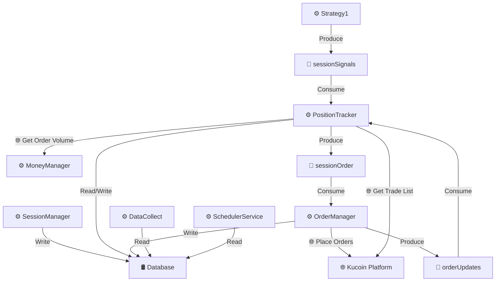
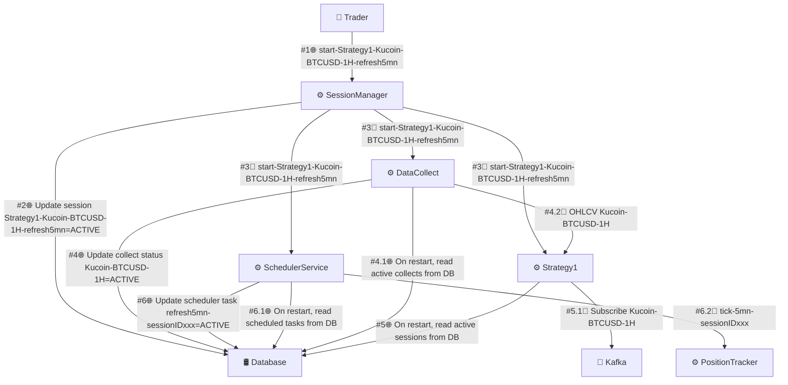
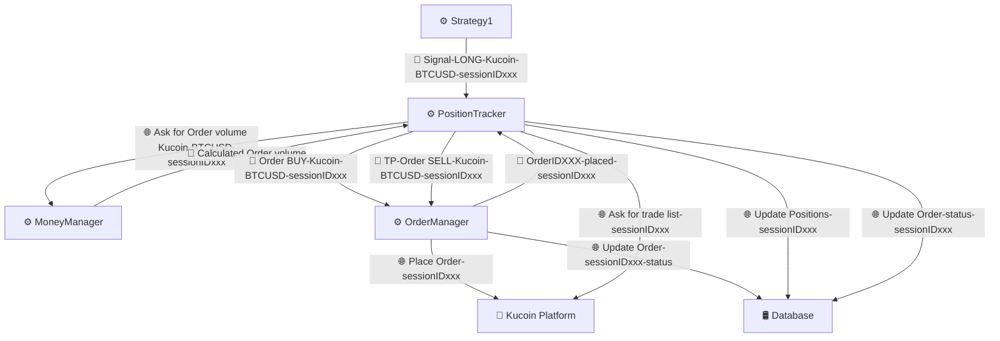
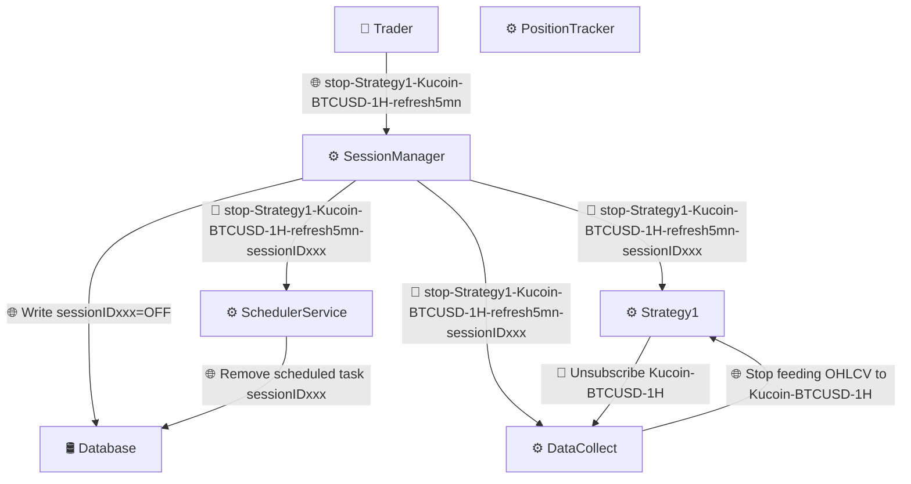

# Services Backend

L'architecture de r3edge repose sur plusieurs microservices bien définis, chacun ayant un rôle spécifique pour répondre aux besoins du projet.

---

## Table des matières
- [Quelques définitions](#quelques-définitions)
- [Exposition des services](#exposition-des-services)
- [Communication interservices](#communication-interservices)
- [Liste des services](#liste-des-services)
- [Stratégies de Scaling Horizontal](#stratégies-de-scaling-horizontal)
- [Partitionnement des Topics Kafka](#partitionnement-des-topics-kafka)
- [Filtrage et Émission des Topics](#filtrage-et-emission-des-topics)

---

## Quelques définitions

Un service central est unique dans le système et non multipliable fonctionnellement, tandis qu'un service factorisable peut être répliqué par besoin fonctionnel, comme par plateforme ou stratégie.

---

## Exposition des services

Traefik, en tant qu'API Gateway, joue un rôle clé en exposant à l'externe une API unifiée pour l'ensemble des microservices de r3edge-engine. Cette API permet aux clients externes d'interagir de manière centralisée avec les différents services backend, sans avoir besoin de connaître leur architecture interne.

---

## Communication interservices

Dans l'architecture de r3edge, les communications entre les microservices backend sont gérées directement, sans passer par l'API Gateway (Traefik). Les services échangent principalement via des API REST internes, des topics Kafka, ou d'autres mécanismes asynchrones.

### Topics Kafka

Les topics Kafka sont le principal mécanisme d'échange asynchrone entre les microservices. Chaque topic est partitionné et consommé via des consumer groups, garantissant l'isolation et la scalabilité des services.

### Diagramme des interactions

Le schéma ci-dessous illustre les interactions principales entre les services backend, les utilisateurs et les topics Kafka :

### Légende

| **Symbole** | **Description**                                    |
|-------------|----------------------------------------------------|
| ⚙️          | Service applicatif (ex. : SessionManager, Strategy1)|
| 🛢️          | Base de données pour stockage des informations     |
| 🔀          | Topic Kafka utilisé pour la communication inter-services |
| 🌐          | Requête API ou interaction avec une plateforme externe |

---
### Exemple d'une session de trading
Cet exemple illustre les interactions entre les services durant une session de trading r3edge engine avec 3 scénarios:
- start d'une session à partir d'un trader utilisateur pour  strategy1 sur kucoin pour BTCUSC en time frame 1H et avec une cadence de suivi de 5 mn
- coeur de session avec déclenchement d'un signal par Strategy1. Ce signal va générer in fine un passage d'ordre, un suivi de positions jusqu'à un TP ou un SL ou un MO (Market Order)
- stop de la session de trading

#### Scénario : Démarrage d'une session de trading

##### **But du scénario : Démarrer une session de trading**
- Déclarer la session ACTIVE en base de données.
- Programmer un scheduler pour cadencer **PositionTracker** toutes les 5 minutes.
- Créer un topic dynamique dédié à **Kucoin-BTCUSD-1H**, alimenté par **DataCollect** et consommé par **Strategy1**.
- Activer **Strategy1** pour **Kucoin-BTCUSD-1H**.
- Identifier clairement les topics et leur mode de consommation.
- Décrire la résilience et la scalabilité de chaque service.

---

##### **Point de départ**
- **r3edge engine** est démarré.
- **Strategy1** est chargée mais dormante, et a souscrit à un consumergroup du topic `command` dédié aux stratégies.
- **DataCollect** a démarré sa collecte des données définies dans sa configuration initiale, y compris **Kucoin-BTCUSD-1H**, et a également souscrit à un consumergroup du topic `command` dédié à la collecte.
- **SchedulerService** est chargé mais dormante, et a souscrit à un consumergroup du topic `command` dédié au scheduler.

---

##### **Liste des interactions**
1. **Trader** envoie `start-Strategy1-Kucoin-BTCUSD-1H-refresh5mn` à **SessionManager**.
2. **SessionManager** écrit `Strategy1-Kucoin-BTCUSD-1H-refresh5mn-sessionIDxxx=ON` dans la base de données.
3. **SessionManager** envoie `start-Strategy1-Kucoin-BTCUSD-1H-refresh5mn-sessionIDxxx` sur le topic `command` à :
   - **Strategy1**
   - **SchedulerService**
   - **DataCollect**
4. **Strategy1** s'abonne au topic dynamique **Kucoin-BTCUSD-1H** via son consumergroup dédié.
5. **SchedulerService** reçoit `start-Strategy1-Kucoin-BTCUSD-1H-refresh5mn-sessionIDxxx`, programme le scheduler, et envoie toutes les 5 minutes un tick `tick-5mn-sessionIDxxx` sur le topic `sessionRequest` à **PositionTracker**.
6. **DataCollect** envoie les **OHLCV 1H** sur le topic **Kucoin-BTCUSD-1H**, consommé par **Strategy1**.

---

##### **Point d'arrivée**
- **Strategy1** est activée.
- **SchedulerService** est auto-programmé pour envoyer des ticks toutes les 5 minutes pour **sessionIDxxx**.
- **DataCollect** alimente en **OHLCV** un topic dynamique consommé par **Strategy1**.
- **PositionTracker** est cadencé toutes les 5 minutes pour actualiser les positions (valorisation).

##### Graphe des interactions

##### Tableau des topics

| **Topic**          | **Exemple / Partition**                                                | **Producteur**       | **Consommateurs**                                         |
|---------------------|-----------------------------------------------------------------------|----------------------|-----------------------------------------------------------|
| `command`          | `start-Strategy1-Kucoin-BTCUSD-1H-refresh5mn`   *Clé = sessionIDxxx → Partition 1* | SessionManager       | - Strategy1 (`group.command.strategy`)                     - SchedulerService (`group.command.scheduler`)             - DataCollect (`group.command.collect`)             |
| `Kucoin-BTCUSD-1H` | `OHLCV Kucoin-BTCUSD-1H`   *Clé = Kucoin-BTCUSD-1H → Partition 1*   | DataCollect          | - Strategy1 (`group.kucoin.strategy`)                    |
| `sessionRequest`   | `tick-5mn-sessionIDxxx`   *Clé = sessionIDxxx → Partition 1*        | SchedulerService     | - PositionTracker (`group.session.tracker`)              |

#### Scénario : Déclenchement d'un signal par Strategy1

##### **But du scénario : Générer des signaux**
- Envoyer des signaux LONG/SHORT lorsque **Strategy1** détecte des opportunités.
- Placer des ordres sur Kucoin tout en maîtrisant les risques (via **MoneyManager**).
- Identifier les ordres exécutés et suivre les positions prises.
- Gérer les ordres de type TP (Take Profit), SL (Stop Loss), et MO (Market Order), déclenchés par **PositionTracker**.

---

##### **Point de départ**
- **Strategy1** est activée, alimenté par le topic `Kucoin-BTCUSD-1H` et prête à envoyer des signaux sur le topic `sessionSignals uniquement pour les besoins des sessions actives (filtrage à l'envoi)
- **SchedulerService** est programmé pour envoyer des ticks toutes les 5 minutes pour la sessionIDxxx.
- **DataCollect** alimente en OHLCV le topic dynamique `Kucoin-BTCUSD-1H`, consommé par **Strategy1**.
- **PositionTracker** est cadencé toutes les 5 minutes pour actualiser les positions (valorisation) et gérer les exécutions d'ordres.

---

##### **Liste des interactions**
1. **Strategy1** envoie `Signal-LONG-Kucoin-BTCUSD-sessionIDxxx` sur le topic `sessionSignals` à **PositionTracker**.
2. **PositionTracker** sur réception du signal, il cherche à placer un ordre LONG et demande le volume de d'ordre à **MoneyManager** via `Ask for Order volume Kucoin-BTCUSD-sessionIDxxx`.
3. **MoneyManager** renvoie le volume calculé à **PositionTracker**.
4. **PositionTracker** envoie `Order BUY-Kucoin-BTCUSD-sessionIDxxx` sur le topic `sessionOrder` à **OrderManager**.
5. **OrderManager** place l’ordre sur la plateforme Kucoin et met à jour la base avec `Order-sessionIDxxx-status`.
6. **OrderManager** envoie une mise à jour d'ordre via `OrderIDXXX-placed-sessionIDxxx` sur le topic `orderUpdates` à **PositionTracker**.
7. **PositionTracker** demande la liste des trades associés (`trade list-sessionIDxxx`) à Kucoin.
8. **PositionTracker** met à jour la base avec :
   - Les positions associées à la session (`Positions-sessionIDxxx`).
   - Le statut des ordres (`Order-status-sessionIDxxx`).
9. Si un TP/SL est déclenché, **PositionTracker** envoie `TP-Order SELL-Kucoin-BTCUSD-sessionIDxxx` sur le topic `sessionOrder` à **OrderManager**.

---

##### **Point d'arrivée**
- La base de données est mise à jour avec :
  - Les ordres passés sur Kucoin (OPENED, CLOSED, CANCELED).
  - Les trades réalisés suite à l'exécution des ordres.
  - Le statut et le niveau d'exécution des ordres (NOT_EXECUTED, PARTIALLY_EXECUTED, FULLY_EXECUTED).

##### Graphe des interactions

##### Tableau des topics

| **Topic**          | **Exemple / Partition**                                        | **Producteur**         | **Consommateurs**                                         |
|---------------------|--------------------------------------------------------------|------------------------|-----------------------------------------------------------|
| `sessionSignals`    | `Signal-LONG-Kucoin-BTCUSD-sessionIDxxx`                     | Strategy1              | PositionTracker                                           |
| `sessionOrder`      | `Order BUY-Kucoin-BTCUSD-sessionIDxxx`                       | PositionTracker        | OrderManager                                              |
| `orderUpdates`      | `OrderIDXXX-placed-sessionIDxxx`                             | OrderManager           | PositionTracker                                           |
| `tradeUpdates`      | `Trade Kucoin-BTCUSD-sessionIDxxx`                           | PositionTracker        | Aucun                                                    |

#### Scénario : Arrêt d'une session

##### **But du scénario : Arrêter une session de trading**
- Annuler tous les ordres en cours et clôturer toutes les positions.
- Désinscrire les services des topics temporaires.
- Nettoyer les caches et les données temporaires de la session.
- Mettre à jour la base de données.

---

##### **Point de départ**
- **Strategy1** est activée et souscrit aux topics `sessionSignals` (pour générer des signaux) et `Kucoin-BTCUSD-1H`.
- **SchedulerService** est programmé pour envoyer des ticks toutes les 5 minutes pour la sessionIDxxx.
- **DataCollect** alimente en **OHLCV** le topic dynamique `Kucoin-BTCUSD-1H`, consommé par **Strategy1**.
- **PositionTracker** est cadencé toutes les 5 minutes pour actualiser les positions (valorisation) et gérer les exécutions d'ordres.

---

##### **Liste des interactions**
1. **Trader** envoie `stop-Strategy1-Kucoin-BTCUSD-1H-refresh5mn` à **SessionManager**.
2. **SessionManager** écrit `Strategy1-Kucoin-BTCUSD-1H-refresh5mn-sessionIDxxx=OFF` dans la base de données.
3. **SessionManager** envoie `stop-Strategy1-Kucoin-BTCUSD-1H-refresh5mn-sessionIDxxx` sur le topic `command` à :
   - **Strategy1**
   - **SchedulerService**
   - **DataCollect**
4. **Strategy1** se désabonne du topic dynamique `Kucoin-BTCUSD-1H`, sauf si une autre session active en a besoin. Il n'envoie plus de signaux à **PositionTracker** via le topic sessionSignals.
5. **SchedulerService** supprime la tâche du scheduler pour la session sessionIDxxx.
6. **DataCollect** cesse d'envoyer les **OHLCV 1H** sur le topic `Kucoin-BTCUSD-1H`, sauf si une autre session active en a besoin.
7. **PositionTracker** cesse de recevoir des ticks pour la sessionIDxxx et n’effectue plus de gestion des positions pour cette session.

---

##### **Point d'arrivée**
- **Strategy1** est activée mais dormante si aucune autre session en cours ne l'a activée. Elle reste abonnée au topic `sessionSignals` et désinscrite du topic `Kucoin-BTCUSD-1H`, sauf si une autre session en a besoin.
- **SchedulerService** a déprogrammé la sessionIDxxx.
- **DataCollect** n'alimente plus le topic dynamique `Kucoin-BTCUSD-1H`, sauf si une autre session active l'exige.
- **PositionTracker** n'est plus cadencé toutes les 5 minutes pour gérer la sessionIDxxx. Il peut être toujours actif pour d'autres sessions.

##### Graphe des interactions

| **Topic**          | **Exemple / Partition**                                        | **Producteur**         | **Consommateurs**                                         |
|---------------------|--------------------------------------------------------------|------------------------|-----------------------------------------------------------|
| `command`          | `stop-Strategy1-Kucoin-BTCUSD-1H-refresh5mn-sessionIDxxx`     | SessionManager         | - Strategy1 (`group.command.strategy`)                     - SchedulerService (`group.command.scheduler`)   - DataCollect (`group.command.collect`) |
| `Kucoin-BTCUSD-1H` | *Cesse d’être utilisé dans ce scénario*                       | DataCollect            | - Strategy1                                               |
| `sessionRequest`   | *Cesse d’envoyer des ticks pour la sessionIDxxx*              | SchedulerService       | - PositionTracker                                         |

## Liste des services

### **SessionManager**
- **Rôle** : Chef d'orchestre de l'ensemble des services. Responsable du démarrage, de l'arrêt, et de la gestion des sessions.
  
- **Comment le service peut scaler ?** :  
  Le scaling horizontal est assuré car **SessionManager** est stateless. Chaque instance peut traiter indépendamment des commandes (start/stop) envoyées par les utilisateurs, avec Kafka assurant la répartition entre les partitions des topics.
  
- **Détail** : [Voir la page dédiée](SessionManager.md)

---

### **StrategyExecutor**
- **Rôle** : Implémente une stratégie de trading spécifique, consommant les données de marché (OHLCV) et générant des signaux LONG/SHORT pour les sessions actives.
  
- **Comment le service peut scaler ?** :  
  Chaque stratégie s’abonne uniquement aux topics liés aux marchés et timeframes nécessaires. Cela limite la charge par instance et permet de scaler horizontalement en ajoutant des consommateurs dans des groupes dédiés.

- **Détail** : [Voir la page dédiée](StrategyExecutor.md)

---

### **DataCollect**
- **Rôle** : Collecte des données de marché en temps réel depuis des APIs externes.
  
- **Comment le service peut scaler ?** :  
  Le service filtre les collectes actives en fonction des sessions configurées, ce qui réduit la charge. Il est entièrement stateless : plusieurs instances peuvent gérer des marchés différents ou les mêmes marchés sur des partitions distinctes.
  
- **Détail** : [Voir la page dédiée](DataCollect.md)

---

### **SchedulerService**
- **Rôle** : Cadence les services selon une configuration spécifique, en envoyant des ticks sur les topics associés aux sessions.
  
- **Comment le service peut scaler ?** :  
  Chaque tâche de scheduling est assignée à un groupe Kafka spécifique. Le scaling horizontal est possible en partitionnant les tâches sur plusieurs instances.

- **Détail** : [Voir la page dédiée](SchedulerService.md)

---

### **PositionTracker**
- **Rôle** : Suit les positions prises sur les plateformes en fonction des ordres exécutés. Gère les mises à jour de la base (positions, ordres) et déclenche les ordres TP/SL/MO.
  
- **Comment le service peut scaler ?** :  
  Chaque instance consomme des ticks et signaux spécifiques à une session via des partitions Kafka. Le scaling horizontal est assuré par l’isolation des sessions.

- **Détail** : [Voir la page dédiée](PositionTracker.md)

---

### **MoneyManager**
- **Rôle** : Calcule les volumes d'ordres basés sur le risque associé au compte de trading et à la session active.
  
- **Comment le service peut scaler ?** :  
  Stateless, il reçoit des requêtes synchrones via une API HTTP. Le scaling horizontal est assuré par un load balancer devant les instances.

- **Détail** : [Voir la page dédiée](MoneyManager.md)

---

### **OrderManager**
- **Rôle** : Place les ordres sur les plateformes de trading, met à jour le statut des ordres dans la base, et informe **PositionTracker** des ordres placés.
  
- **Comment le service peut scaler ?** :  
  Chaque instance peut gérer des partitions Kafka distinctes liées aux ordres. Le scaling horizontal est assuré par la séparation des sessions.

- **Détail** : [Voir la page dédiée](OrderManager.md)

---

### **Base de Données**
- **Rôle** : Stocke les informations persistentes : sessions, positions, ordres et leurs statuts.
  
- **Comment le service peut scaler ?** :  
  La base peut être configurée pour un mode distribué (par exemple, PostgreSQL avec clustering ou partitionnement logique des tables par session) pour absorber une charge croissante.

- **Détail** : [Voir la page dédiée](Database.md)

---

### **Kafka**
- **Rôle** : Bus de messages utilisé pour la communication entre services et la gestion des topics liés aux sessions.
  
- **Comment le service peut scaler ?** :  
  Kafka est conçu pour le scaling horizontal : les partitions permettent de répartir la charge entre plusieurs producteurs et consommateurs. Une configuration adaptée des clés et des partitions garantit un scaling efficace.

- **Détail** : [Voir la page dédiée](Kafka.md)

---

## Stratégies de Scaling Horizontal

### Scaling des services via Kafka
- Les services utilisent des consumer groups pour scaler horizontalement sans conflit.
- Chaque topic est partitionné en fonction des clés pertinentes (par exemple `sessionID` ou `strategyID`), permettant une répartition efficace des workloads entre les instances.

Exemple :
- **DataCollect** : Scaling horizontal basé sur les sessions actives, identifiées par des clés spécifiques (ex. : `marketID` ou `sessionID`), avec une table centralisée pour la résilience.
- **Strategy1** : Partitionnement par `sessionID` pour isoler les stratégies actives.
- **SessionManager** : Stateless, il s’appuie sur Kafka et un load balancer pour gérer les requêtes REST simultanées.
- **PositionTracker** : Partitionnement par `sessionID` pour le suivi des positions et la gestion des ordres spécifiques à chaque session.
- **MoneyManager** : Stateless, gère les requêtes HTTP synchrone via un load balancer.
- **OrderManager** : Partitionnement par `sessionID` pour gérer les ordres et les mises à jour associées.

---

## Filtrage et Émission des Topics

### Filtrage dynamique
Les services émetteurs (DataCollect, Strategy1) appliquent des filtres pour garantir que seuls les messages pertinents pour les sessions actives sont publiés. Cela réduit la charge réseau et optimise le traitement en aval.

| **Service**          | **Topic**          | **Critères de Filtrage**                                     |
|-----------------------|--------------------|--------------------------------------------------------------|
| **DataCollect**       | `Kucoin-BTCUSD-1H`| Sessions actives : timeframe, marché, plateforme.            |
| **SchedulerService**  | `sessionRequest`  | Sessions actives nécessitant un tick cadencé (toutes les 5 min). |
| **Strategy1**         | `sessionSignals`  | Signaux générés pour les sessions actives.                  |
| **OrderManager**      | `orderUpdates`    | Mises à jour des statuts d’ordres associés aux sessions.     |
| **PositionTracker**   | `tradeUpdates`    | Suivi des positions et des trades réalisés pour chaque session. |

## Liens utiles
- [Retour à la Table des Matières](index.md)
- [Dépôt principal de la documentation](https://github.com/dsissoko/r3edge-engine-docs)
